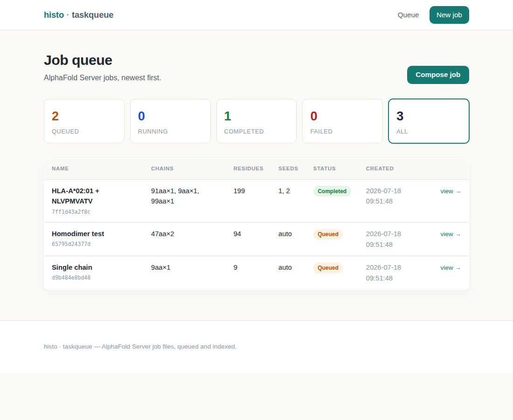

# histo · taskqueue

A small task queue for **AlphaFold Server** job files.

Compose a job from up to **five protein sequence chains**, and the app serialises
it to the exact JSON format the [AlphaFold Server](https://alphafoldserver.com)
ingests, stores the JSON object (local filesystem or S3), and indexes the job
metadata in **DuckDB** so the queue can be listed, filtered and worked through.
The UI is styled to echo [Histo.fyi](https://www.histo.fyi).



## Features

- **Compose jobs** — 1–5 protein chains (sequence + copy count), a name, and
  optional model seeds. Sequences are validated against the 20 standard amino
  acids.
- **AlphaFold Server format** — every job downloads as the canonical
  `[ { "name", "modelSeeds", "sequences", "dialect", "version" } ]` array.
- **Pluggable object store** — `local` filesystem (default) or `s3` (boto3).
- **DuckDB index** — fast listing, status filtering, and per-status counts.
- **Queue lifecycle** — `queued → running → completed | failed`, with a FIFO
  `claim` for workers.
- **JSON API** and a minimal **worker CLI** that drains the queue.

## Tech stack

Python 3.11 · [uv](https://docs.astral.sh/uv/) · Flask · DuckDB · boto3 (optional) · pytest.

## Quick start

```bash
# install dependencies (dev + optional s3 extras)
uv sync --extra dev --extra s3

# run the web app (http://127.0.0.1:8000)
uv run histo-taskqueue

# in another shell: drain the queue with the worker
uv run histo-worker --all
```

Open <http://127.0.0.1:8000>, click **Compose job**, paste up to five sequences,
and queue it. The job detail page shows the exact AlphaFold Server JSON and a
**Download job file** button.

### Configuration

All settings are environment variables (sensible local defaults):

| Variable              | Default                 | Meaning                                   |
|-----------------------|-------------------------|-------------------------------------------|
| `HTQ_STORE_BACKEND`   | `local`                 | `local` or `s3`                           |
| `HTQ_DATA_DIR`        | `data`                  | Base dir for local objects + DuckDB file  |
| `HTQ_OBJECTS_DIR`     | `<data>/objects`        | Local JSON object directory               |
| `HTQ_INDEX_PATH`      | `<data>/index.duckdb`   | DuckDB index file                         |
| `HTQ_S3_BUCKET`       | —                       | Bucket (required for `s3`)                |
| `HTQ_S3_PREFIX`       | `jobs`                  | Key prefix in the bucket                  |
| `HTQ_S3_ENDPOINT_URL` | —                       | Custom endpoint (MinIO / localstack)      |
| `HTQ_SECRET_KEY`      | `dev-secret-change-me`  | Flask session secret                      |
| `HTQ_SERVER_URL`      | `http://127.0.0.1:8000` | Base URL the worker talks to              |
| `PORT`                | `8000`                  | Web server port                           |

Example with S3:

```bash
HTQ_STORE_BACKEND=s3 HTQ_S3_BUCKET=my-af-jobs uv run histo-taskqueue
```

## AlphaFold Server job format

The downloaded file is an **array of jobs** (so one file can hold several):

```json
[
  {
    "name": "HLA-A*02:01 + NLVPMVATV",
    "modelSeeds": [1, 2],
    "sequences": [
      { "proteinChain": { "sequence": "GSHSMRYFFT...", "count": 1 } },
      { "proteinChain": { "sequence": "NLVPMVATV", "count": 1 } }
    ],
    "dialect": "alphafoldserver",
    "version": 1
  }
]
```

- `modelSeeds` — list of integers; empty ⇒ the server auto-assigns.
- `proteinChain.count` — number of identical copies of that chain.
- `dialect` is always `"alphafoldserver"`, `version` is `1`.

## HTTP API

| Method | Path                       | Purpose                               |
|--------|----------------------------|---------------------------------------|
| GET    | `/`                        | Queue dashboard (`?status=` filter)   |
| GET    | `/jobs/new`                | Compose form                          |
| POST   | `/jobs`                    | Create a job (form-encoded)           |
| GET    | `/jobs/<id>`               | Job detail                            |
| GET    | `/jobs/<id>/download`      | Download the AlphaFold job file       |
| POST   | `/jobs/<id>/status`        | Set status (form)                     |
| POST   | `/jobs/<id>/delete`        | Delete a job                          |
| GET    | `/api/jobs`                | List jobs + counts (JSON)             |
| GET    | `/api/jobs/<id>`           | Job record + file (JSON)              |
| POST   | `/api/jobs/claim`          | FIFO claim next queued job → running  |
| POST   | `/api/jobs/<id>/status`    | Set status (JSON)                     |
| GET    | `/healthz`                 | Health check                          |

## Worker

The Flask app is the single owner of the DuckDB index (DuckDB allows only one
read-write process at a time), so the worker talks to the **running app** over
its JSON API:

```bash
uv run histo-worker            # claim + process one job
uv run histo-worker --all      # drain the whole queue
uv run histo-worker --list     # print queue counts
uv run histo-worker --url http://host:8000
```

The bundled worker is a stand-in — it validates the stored job file and marks the
job `completed`. Real AlphaFold execution is out of scope for v1 (see `PLAN.md`).

## Architecture

```
histo_taskqueue/
  config.py     Environment-driven configuration
  alphafold.py  Validate chains + build/parse AlphaFold Server job JSON
  store.py      ObjectStore interface; LocalFileStore + S3Store
  index.py      JobIndex — DuckDB schema, upsert, list/filter, counts
  queue.py      JobQueue — create / get / claim / set_status / delete
  app.py        Flask app factory + routes
  templates/    base · index · new · detail
  static/css/   histo.css
worker.py       HTTP worker CLI
```

The object store is the **source of truth** (it holds the full job files); the
DuckDB index holds queryable metadata and can be rebuilt from the store.

## Development

```bash
uv sync --extra dev
uv run pytest        # 31 tests: unit + Flask route integration
```

## License

MIT — see `LICENSE`.
